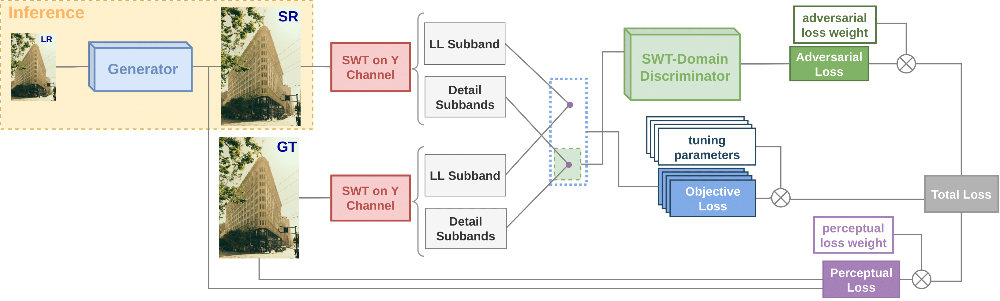
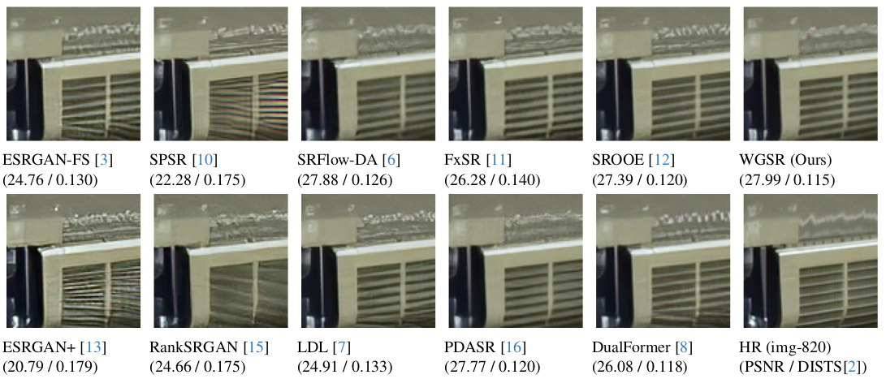
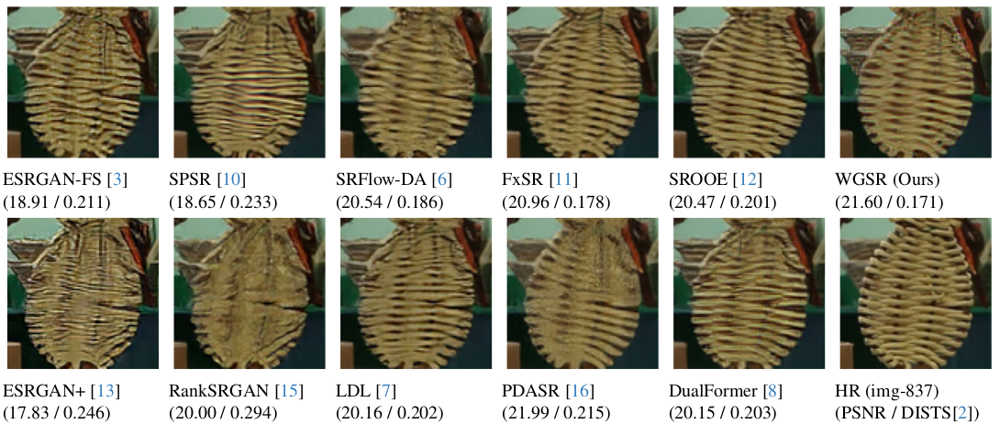

# WGSR  
> In CVPR 2024

### Training Generative Image Super-Resolution Models by Wavelet-Domain Losses Enables Better Control of Artifacts 
[Paper Link](https://arxiv.org/abs/2402.19215) | [Supplementary Material](https://drive.google.com/file/d/1MWOiRrN_MtlsRkZhG-A_iwkvXknaF_LX/view?usp=sharing)

[Cansu Korkmaz](https://mandalinadagi.github.io/), [A. Murat Tekalp](http://mysite.ku.edu.tr/mtekalp/), [Zafer Dogan](https://mysite.ku.edu.tr/zdogan/)

📌 [Youtube Video](https://www.youtube.com/watch?v=S3UugbDTxYs)

<p align="center">
  
</p>

### SR 4X Results on [DIV2K Validation Set](https://data.vision.ee.ethz.ch/cvl/DIV2K/)




### Getting Started: 

- clone this repository
```
git clone https://github.com/mandalinadagi/WGSR
cd WGSR
```
- Install dependencies. (Python >= 3.7 + CUDA)
- Require pytorch=1.9.1: [official instructions](https://pytorch.org/get-started/previous-versions/)
- Install other requirements: 
```
pip install numpy opencv-python lmdb tensorboardX
```
## How To Test
Download pretrained models from [Google Drive](https://drive.google.com/drive/folders/19Ur1SF-49erDA8fOoZAx1_Pnt7ZKRT0X?usp=drive_link) and place them in `test_image/pretrained_models`.

If you want to test our model with a dataset folder containing low-resolution images:

```
cd test_image
python test.py ./pretrained_models/WGSR_2lvl_G.pth <path to dataset folder>
```

If you want to test our model with single low-resolution image: 
First place your low-resolution images in `test_image/LR` folder, then
```
cd test_image
python test.py ./pretrained_models/WGSR_2lvl_G.pth
```

The super-resolution results are in `test_image/<model_name>/results` folder.

2. The WGSR model trained by 1 level stationary wavelet coefficients (WGSR_1lvl_G.pth) is also provided.

## How to Train
1. Prepare the datasets which can be downloaded from [Google Drive](https://drive.google.com/drive/folders/1pRmhEmmY-tPF7uH8DuVthfHoApZWJ1QU?usp=sharing).
2. Prepare the PSNR-oriented pretrained [RRDB model](https://drive.google.com/file/d/1g6IVLgMR28jisZyw9y-pekiAsq7f2fzV/view?usp=drive_link).
3. Modify the configuration file `codes/options/train/train_WGSR.json`. (dataroot_HR, dataroot_LR, pretrain_model_G)
4. Run the command `python train.py -opt /options/train/train_WGSR.json`.
   
Please note that when 2 level stationary wavelet is used, input channel for discriminator model must be set to 6, (options/train/train_WGSR.json line 50 in_nc=6)

## Citation
If you find the code helpful in your resarch or work, please cite the following papers.
```
@inproceedings{korkmaz2024training,
  title={Training Transformer Models by Wavelet Losses Improves Quantitative and Visual Performance in Single Image Super-Resolution},
  author={Korkmaz, Cansu and Tekalp, A. Murat and Dogan, Zafer},
  booktitle={Proceedings of the IEEE/CVF Conference on Computer Vision and Pattern Recognition (CVPR)},
  month={June},
  year={2024}
}
```

## Additional Results
Thanks for their great work, our wavelet-domain loss function is also implemented by [neosr](https://github.com/muslll/neosr/), so please feel free to utilize our loss function with different architectures. Cheers!

Here are several visual results from neosr, showing the effectiveness of wavelet-domain loss function. 


## Contact
If you have any questions please email at ckorkmaz14@ku.edu.tr

_Our code is based on [ESRGAN+](https://github.com/ncarraz/ESRGANplus). Thanks to their great work._
