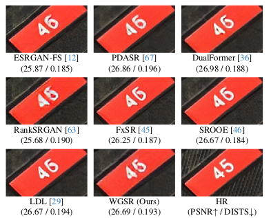

# WGSR  
> In CVPR 2024

### Training Generative Image Super-Resolution Models by Wavelet-Domain Losses Enables Better Control of Artifacts 
[Paper Link]() | [Supplementary Material]()

[Cansu Korkmaz](https://mandalinadagi.github.io/), [A. Murat Tekalp](http://home.ku.edu.tr/~mtekalp/), [Zafer Dogan](https://mysite.ku.edu.tr/zdogan/)


<p align="center">
  
</p>



### SR 4X Results on [DIV2K Validation Set](https://data.vision.ee.ethz.ch/cvl/DIV2K/)


### Getting Start

- clone this repository
```
git clone https://github.com/mandalinadagi/WGSR
cd WGSR
```
- Install dependencies. (Python >= 3.7 + CUDA)
- Require pytorch=1.9.1: [official instructions](https://pytorch.org/get-started/previous-versions/)
- Install other requirements
```
pip install -r requirements.txt
```
## How To Test
	1. Place your low-resolution images in `test_image/LR` folder.
	2. Download pretrained models from [Google Drive]() and place them in `test_image/pretrained_models`.
	2. Run the command: `python test_image/test.py test_image/pretrained_models/nESRGANplus.pth` (or any other models).
	3. The results are in `test_image/results` folder.

## How to Train

	1. Prepare the datasets which can be downloaded from [Google Drive]().
	2. Prepare the PSNR-oriented pretrained model (all pretrained models can be downloaded from [Google Drive]()).
	2. Modify the configuration file `codes/options/train/train_WGSR.json`.
	3. Run the command `python train.py -opt codes/options/train/train_WGSR.json`. 


## Contact
If you have any questions please email at ckorkmaz14@ku.edu.tr

_Our code is based on [ESRGAN+](https://github.com/ncarraz/ESRGANplus). Thanks to their great work._
